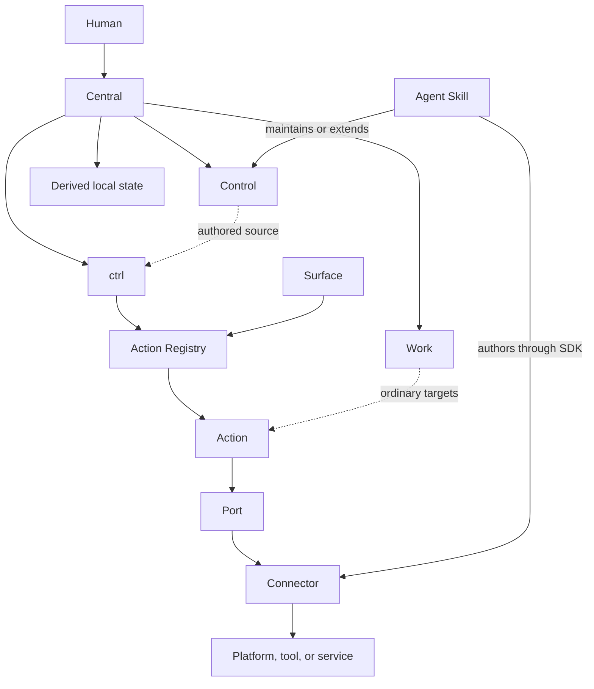

# Central — System Specification

**Status:** normative product specification

## 0. Scope and language

This document specifies the Central product.

The product includes:

- the Central filesystem protocol;
- the Control source domain;
- the Work root;
- the `ctrl` command-line interface;
- the Action model;
- Port contracts;
- Connector discovery and execution;
- Surface integration;
- the Connector SDK;
- Connector conformance tests;
- Control-maintenance and Connector-authoring skills;
- portable machine declarations;
- local derived state;
- the personal extension set that proves the open architecture.

This document uses **must** for a product requirement. It uses **can** for an allowed capability. It uses **should** only when the implementation can use another method and still satisfy the same product requirement.

Technical names have one meaning in this document. Section 2 defines these names.

## 1. Product definition

Central is a human-owned operating root for a computing environment that includes people, machines, software agents, tools, automation, and work.

Central has this default filesystem form:

```text
~/Central/
├── Control/
│   ├── user/
│   ├── agents/
│   └── machines/
├── ctrl/
├── .central/
└── Work/
```

The Central root is a Git repository in the normal personal installation.

`Work/` and `.central/` must not become portable repository content by default.

```text
Control/     durable human-owned source
ctrl/        executable product and extension SDK
.central/    derived local state
Work/        ordinary local work
```

Central must remain understandable through normal filesystem tools when `ctrl` is not available.

`ctrl` must remain useful when optional Connectors are not available.

A Connector must not become a hidden requirement for the core product unless the Port contract declares that requirement for a specific Action on a specific platform.

## 2. Technical names

### 2.1 Central

**Central** is the filesystem protocol and one local instance of that protocol.

Central contains Control, `ctrl`, local derived state, and Work.

### 2.2 Control

**Control** is durable human-owned source material.

A Control item exists because the human authored it, adopted it, or explicitly retained it.

Control is not a complete store of all machine facts or agent observations.

### 2.3 Work

**Work** is the ordinary local filesystem field that contains project directories and other work material.

A Work directory does not require a Central-specific project format.

### 2.4 ctrl

**ctrl** is the executable control surface for Central.

`ctrl` discovers Actions, accepts Action input, resolves required Ports, selects eligible Connectors, executes the operation, and returns a structured result.

### 2.5 Action

An **Action** is a stable semantic operation.

Examples are `work.open`, `control.search`, and `machine.inspect`.

An Action describes what the product does. It does not name the tool that implements the operation.

### 2.6 Port

A **Port** is an abstract capability that an Action requires.

Examples can include `WorkDiscovery`, `NativeOpen`, `PackageManager`, `ConfigurationManager`, `Automation`, and `TagStore`.

A Port defines behavior, input, output, capability checks, and error semantics.

### 2.7 Connector

A **Connector** implements one or more Ports for a platform, tool, or service.

A Connector can use an operating-system API, a CLI, a library, a local service, or a remote service.

### 2.8 Surface

A **Surface** presents or invokes Actions.

The CLI is the required base Surface. Other Surfaces can include a terminal picker, launcher, OS automation system, keybinding, agent tool interface, or graphical application.

A Surface must not own duplicate Action logic.

### 2.9 Skill

A **Skill** is a reusable agent procedure.

A Skill can teach an agent how to maintain Control, author a machine declaration, build a Connector, or diagnose a Connector.

A Skill is not Control content.

### 2.10 Authored source

**Authored source** is information that the human deliberately states, adopts, or retains as durable material.

### 2.11 Observation

An **Observation** is information that software measures or discovers from the current environment.

### 2.12 Inference

An **Inference** is information that software derives from evidence.

### 2.13 Derived state

**Derived state** is local state that software produces from authored source, observations, Connectors, or previous operations.

Derived state does not have higher authority than authored source.

## 3. Constitutional invariants

The implementation must preserve these invariants.

### 3.1 Human-owned source

An Observation or Inference must not silently become authored Control source.

An agent can propose a Control change. The proposal must preserve its provenance. The human must explicitly accept the durable mutation.

### 3.2 One Action identity

A semantic operation must have one Action identity across all Surfaces.

A launcher entry and a shell command that perform the same semantic operation must invoke the same Action.

### 3.3 Core depends on Ports

Core Action code must depend on Port contracts. It must not depend directly on optional product-specific Connectors.

### 3.4 Connectors are replaceable

A Connector must be replaceable by another Connector that satisfies the same Port and eligibility requirements.

### 3.5 Work stays ordinary

A user must be able to create, move, remove, or use Work directories with ordinary filesystem tools.

### 3.6 Derived state stays subordinate

The user must be able to remove rebuildable `.central/` state without deleting authored Control source or Work content.

### 3.7 Availability does not imply disclosure

The existence of a Control item must not automatically make that item part of every agent context.

### 3.8 Personal extensions use public contracts

The personal extension set must use the public SDK, public Port contracts, and public conformance tests.

Core code must not contain a private execution path for the preferred personal tool stack.

## 4. Filesystem protocol

### 4.1 Root discovery

`ctrl` must resolve the active Central root.

The default root is `$HOME/Central` where the host platform has a normal home-directory concept.

The implementation must support an explicit root override.

A command must be able to report the resolved root.

### 4.2 Repository boundary

The Central repository can contain authored Control material, product source, SDK source, skills, documentation, and portable machine declarations.

The normal repository ignore policy must exclude:

```text
/Work/
/.central/
```

Individual Work directories can be independent repositories.

### 4.3 Control roots

The protocol defines these three Control roots:

```text
Control/user/
Control/agents/
Control/machines/
```

The protocol does not require a fixed schema below these roots unless a specific structured feature defines one.

Human-readable Markdown must remain a first-class source format.

### 4.4 Work naming

The personal convention uses lowercase names for ordinary project directories under `Work/`.

`ctrl` must not reject an external or imported Work directory only because the directory does not follow this convention.

### 4.5 Derived local state

`.central/` is the reserved root for local derived state.

The implementation can use subdirectories such as:

```text
.central/
├── cache/
├── state/
├── index/
└── generated/
```

The implementation must document any non-rebuildable local state that it places below `.central/`.

## 5. Control information model

### 5.1 Persistence rule

Control must favor durable, high-value information.

Information should remain at the narrowest scope where it stays correct.

Project-specific information should remain with the project. Task-specific information should remain with the task. Cross-context durable information can enter Control.

### 5.2 User material

`Control/user/` can contain:

- self-description;
- durable interests and concerns;
- important context objects;
- durable tool-use descriptions;
- stable working preferences;
- durable vocabulary or concepts that prevent repeated misunderstanding.

The system must not require a universal personal-profile schema.

### 5.3 Agent-governance material

`Control/agents/` can contain:

- communication preferences;
- collaboration style;
- initiative preferences;
- research and evidence expectations;
- coding habits;
- evaluation criteria;
- durable positive examples;
- recognized lessons from repeated interaction;
- preferences for classes of capabilities or methods.

The system must not treat `Control/agents/` as the Skill registry.

### 5.4 Machine material

`Control/machines/` can contain:

- machine roles;
- intended software and tools;
- package declarations;
- configuration declarations or references;
- service declarations;
- shell configuration;
- automation declarations;
- bootstrap mechanisms;
- portable host-role information.

The system must keep authored machine intent separate from current machine Observation.

### 5.5 Positive examples

Control can use positive examples when an example expresses the desired behavior more clearly than an abstract rule.

A maintenance Skill should be able to identify repeated negative instructions and propose a clearer positive statement where appropriate.

### 5.6 Procedure boundary

Long reusable procedures should not be placed in general Control context.

A Skill, script, Action, or other capability should contain reusable procedure.

Control can state that the human prefers or requires that capability in a given class of work.

## 6. Control mutation and provenance

### 6.1 Direct human edits

The human can edit Control with normal filesystem and Git tools.

`ctrl` must not require that Control changes pass through the CLI.

### 6.2 Agent proposals

An agent-assisted mutation flow must present:

- the proposed change;
- the target source;
- the reason for the change;
- the evidence or observations that caused the proposal;
- the final diff before durable mutation.

### 6.3 No silent promotion

Repeated successful agent behavior can produce local operational learning. It must not silently promote that learning into durable authored source.

### 6.4 Audit and pruning

Central must include a maintenance path that helps the human find:

- stale material;
- duplicate material;
- conflicting material;
- low-value material;
- material that belongs at a narrower scope;
- procedures that should become Skills or Actions.

The maintenance path can use an agent Skill. The final durable change remains human-governed.

## 7. Action model

### 7.1 Action identity

Each Action must have a stable machine-readable identifier.

Recommended identifiers use a domain and verb form, for example:

```text
central.doctor
control.open
work.open
machine.inspect
action.list
connector.inspect
```

Human CLI aliases can be shorter than the canonical Action ID.

Example:

```text
ctrl open foo
```

can invoke `work.open`.

### 7.2 Action descriptor

An Action descriptor must contain enough data for multiple Surfaces to render and invoke the Action.

The descriptor must support at least:

```text
id
title
description
input definitions
output definition
mutation class
preview support
required Ports
availability status
```

An input definition must be able to declare a selectable source when the value can come from a discoverable set.

Example: `work.open` can request one Work item from `WorkDiscovery`.

### 7.3 Execution result

Every Action must return a structured result.

The result must distinguish:

- success;
- user cancellation;
- unavailable capability;
- invalid input;
- Connector failure;
- policy or safety refusal where applicable;
- partial completion when an Action explicitly supports partial results.

Human-readable output is a rendering of this result.

### 7.4 Mutation classes

Actions must declare whether they are:

- read-only;
- locally mutating;
- externally mutating.

Mutating Actions should support preview when a useful preview can be produced.

### 7.5 Action discovery

`ctrl` must provide machine-readable Action discovery.

A Surface must be able to list available Actions without parsing terminal prose.

## 8. Core Action domains

The product defines these foundational domains. Exact CLI aliases can develop while canonical Action meaning stays stable.

### 8.1 `central.*`

Purpose: operate the Central root.

Expected Actions include:

- resolve or show the Central root;
- initialize the required Central structure;
- diagnose protocol and Connector readiness;
- run configured synchronization or recovery operations.

### 8.2 `control.*`

Purpose: enter and search durable Control source.

Expected Actions include:

- open a Control root or item;
- search Control;
- inspect source metadata when available;
- start an explicit proposed-change flow.

### 8.3 `work.*`

Purpose: operate on ordinary Work directories.

Expected Actions include:

- list Work items;
- search Work items;
- open a Work item;
- reveal a Work item in a native file surface;
- read or change optional local metadata through a Port.

### 8.4 `machine.*`

Purpose: compare intended machine state with observed machine state and apply supported changes.

Expected Actions include:

- inspect current machine state;
- resolve the relevant machine declaration;
- plan a state change;
- apply a supported state change;
- verify the result.

### 8.5 `action.*`

Purpose: inspect the Action system.

Expected Actions include:

- list Actions;
- search Actions;
- explain Action requirements and current availability.

### 8.6 `connector.*`

Purpose: inspect and diagnose the extension system.

Expected Actions include:

- list discovered Connectors;
- inspect Connector metadata;
- show Port coverage;
- run Connector health checks;
- run conformance checks where appropriate.

## 9. Port contract

### 9.1 Purpose

A Port is the stable dependency seam between core behavior and environment-specific implementation.

### 9.2 Port definition

A Port contract must define:

- Port identity;
- operations;
- operation input and output;
- capability probe behavior;
- error classes;
- required determinism or idempotence properties;
- mutation and preview requirements where applicable;
- conformance tests.

### 9.3 Port granularity

A Port must represent a coherent capability.

A Port must not be so broad that every Connector must implement unrelated functions.

A Port must not be so narrow that core Actions depend on a large number of tool-shaped interfaces.

### 9.4 Provider-neutral core

A core Action must not branch on Connector brand when the Port contract can express the required difference.

If real extension work exposes a missing semantic requirement, the project must first determine whether the Port contract needs a general capability extension.

The project must not add a private condition only for the preferred personal Connector.

## 10. Connector model

### 10.1 Connector manifest

Each Connector must have a machine-readable manifest.

The manifest must declare at least:

- Connector identity;
- Connector version;
- implemented Ports;
- supported host platforms or environments;
- runtime requirements;
- dependency probes;
- entrypoint;
- configuration requirements;
- declared permissions or mutation scope where applicable.

### 10.2 Discovery

`ctrl` must discover installed or local Connectors without requiring a core source edit for each Connector.

### 10.3 Eligibility

A discovered Connector is eligible for a Port only when:

- the Connector declares the Port;
- the current platform matches its requirements;
- required dependencies are available;
- required configuration is valid;
- the Connector passes the required capability probe.

### 10.4 Selection

If more than one Connector can satisfy a Port, `ctrl` must use deterministic selection rules.

The user must be able to inspect which Connector was selected and why.

The system can support explicit user preference without confusing preference with availability.

### 10.5 Failure isolation

A Connector failure must return a typed failure to the core.

A Connector must not corrupt the Action registry or prevent unrelated Connectors from loading when isolation is technically possible.

## 11. Surface contract

### 11.1 Base CLI Surface

The CLI is the required Surface.

The CLI must support:

- explicit Action invocation;
- human-readable output;
- structured output;
- Action discovery;
- non-interactive use;
- predictable exit status.

### 11.2 Guided terminal Surface

When the terminal supports interactive use, `ctrl` should provide a searchable Action picker.

The picker should use Action descriptors and selectable input sources.

### 11.3 External Surfaces

An external Surface must consume canonical Action descriptors or stable CLI/SDK interfaces.

It must not duplicate the Action implementation.

### 11.4 Agent use

A software agent must be able to discover Actions and invoke them through structured input and output.

An agent-specific adapter can project Actions into a tool protocol. That adapter remains a Surface or Connector layer. It does not redefine the Action.

## 12. Machine domain

### 12.1 Intended state

Machine declarations in Control express intended state and machine role.

The declaration format must be open and versionable.

The format can reference external configuration mechanisms rather than copy their complete internal configuration.

### 12.2 Observed state

Machine inspection produces Observation data.

Observation can include host platform, architecture, installed tools, available services, Connector dependencies, and other facts required by machine Actions.

Observation belongs to derived state unless the human explicitly promotes a fact into authored source.

### 12.3 Plan

`machine.plan` must compare intended state with observed state and produce a structured change plan.

The plan must identify which Port and Connector will perform each supported operation.

### 12.4 Apply

`machine.apply` must execute an accepted plan through Ports.

The Action must not embed package-manager or configuration-manager implementation logic in the core.

### 12.5 Verify

`machine.verify` must observe the relevant state after application and report whether the intended state is satisfied.

## 13. Connector SDK

The SDK is a required product surface.

The SDK must provide:

- Port interface definitions;
- Connector manifest schema;
- Connector loading contract;
- typed input and output models;
- error model;
- test fixtures;
- conformance runner;
- example Connector source;
- local development command;
- diagnostics for failed discovery, eligibility, and conformance;
- documentation suitable for a human developer and software agent.

The SDK must not require an extension developer to understand private core implementation details.

## 14. Agent Skills

Central must keep Skill content separate from Control source.

The product should include Skills for these system tasks:

### 14.1 Control maintenance Skill

The Skill helps an agent:

- inspect Control structure;
- identify stale, repeated, or misplaced content;
- preserve source authorship;
- propose changes with provenance;
- avoid silent source mutation.

### 14.2 Machine declaration Skill

The Skill helps an agent:

- inspect a real machine or technology stack;
- distinguish authored intent from observed state;
- propose an open machine declaration;
- identify which Ports the environment requires;
- identify missing Connectors.

### 14.3 Connector authoring Skill

The Skill helps an agent:

- read the SDK and target Port contract;
- inspect the target technology documentation;
- scaffold a Connector;
- implement required operations;
- run conformance tests;
- diagnose failures;
- report any general Port-contract gap instead of adding a private core exception.

### 14.4 Connector hardening Skill

The Skill helps an agent use a real Connector, collect failures, classify the failure source, improve tests, and propose SDK or Port changes when the failure reveals a general contract issue.

## 15. Personal extension system

The personal extension set is a required proof environment for the public architecture.

It is not part of the core dependency set.

The first installation targets a macOS workstation and an Ubuntu server environment.

The macOS set should exercise:

- native file open and reveal behavior;
- native filesystem metadata where useful;
- native OS automation;
- a searchable launcher Surface;
- package operations through a package Port;
- configuration operations through a configuration Port.

The Ubuntu set should exercise equivalent machine and package/configuration abstractions through different Connectors.

The exact products used by the personal extension set can change without changing the core Action or Port identity.

The project must build these extensions through the public SDK.

## 16. Privacy and source eligibility

Central must preserve the distinction between filesystem access and agent disclosure.

A Control item can require one or more of these treatment classes:

- normal portable source;
- local-only source;
- encrypted source;
- not agent-readable;
- agent-readable only in eligible contexts;
- restricted from selected external providers.

The first implementation does not need a large policy engine. It must provide a safe path for material that must not enter agent retrieval.

Secrets should use a dedicated secret mechanism or external secret reference. General Control prose must not become the secret store.

## 17. Diagnostics and explainability

`ctrl doctor` must inspect the Central environment and produce a structured report.

The report should cover:

- root validity;
- required directories;
- repository ignore expectations;
- Action registry validity;
- Connector discovery;
- Connector dependency probes;
- Port coverage;
- machine declaration parse status;
- derived-state health.

Action and Connector diagnostics must make the current resolution visible.

For a given Action, the user must be able to determine:

```text
which Action was invoked
which Ports it required
which Connectors were eligible
which Connector was selected
what operation ran
what structured result returned
```

## 18. Cross-platform requirements

The core product must not encode a macOS-only path, API, tag system, launcher, package manager, or configuration system as a universal requirement.

Platform-specific behavior belongs in a Connector or Surface adapter unless the behavior is part of the portable filesystem protocol.

The Central root must support explicit configuration when `$HOME/Central` is not appropriate.

Logical identities should not use absolute host paths as permanent identity when a stable Central-relative identity is possible.

## 19. Test architecture

Testing is part of the public contract.

### 19.1 Core unit tests

Core tests must cover:

- Action registration;
- Action input validation;
- Port requirement resolution;
- deterministic Connector selection;
- structured result and error behavior;
- Central root discovery;
- Control and Work path handling;
- derived-state deletion and rebuild behavior where implemented.

### 19.2 Port contract tests

Each Port must have conformance tests that any Connector implementation can run.

### 19.3 Connector tests

A Connector must have tests for:

- manifest validity;
- dependency detection;
- eligibility;
- operation success;
- typed failure behavior;
- mutation preview where required;
- idempotence or repeat behavior where the Port requires it.

### 19.4 Surface tests

Surface tests must prove that the Surface invokes the canonical Action instead of a duplicate implementation.

### 19.5 Personal-extension acceptance tests

The personal extension set must prove the public architecture against real systems.

A passing personal installation is not sufficient if it bypasses SDK conformance.

### 19.6 Cross-platform acceptance

At least two materially different host environments must satisfy shared core Actions through different Connectors before the relevant portability claim is considered proven.

## 20. Failure model

The implementation must make failures specific.

The user must be able to distinguish at least:

- Action not found;
- invalid input;
- required Port has no eligible Connector;
- Connector dependency missing;
- Connector configuration invalid;
- Connector execution failed;
- requested source is not eligible for the current use;
- machine plan cannot satisfy a required state;
- external mutation failed;
- verification failed after mutation.

The CLI must not collapse these failures into one generic non-zero result without a structured error.

## 21. Security boundary

Core code must treat external commands and Connector input as untrusted operational boundaries.

Connectors must declare mutation scope where practical.

The product should make mutating behavior visible before execution when a useful preview is available.

The product must not write agent-generated content into durable Control source without an explicit mutation step.

## 22. Documentation requirements

The repository must contain:

- product vision;
- this system specification;
- Control content protocol;
- Connector SDK specification;
- personal extension specification;
- user CLI reference when commands exist;
- SDK reference when the SDK exists;
- Connector authoring guide;
- Skill documentation;
- conformance test instructions.

Documentation must use stable technical names from this specification.

Technical procedures should use direct, functional language, active voice, short sentences, and one term for one product concept.

## 23. Product acceptance criteria

The product is complete against this specification when all of these statements are true:

1. A user can create or recover a Central root and inspect it without special software.
2. Work remains ordinary and independent of the Central repository history.
3. Control supports user, agent-governance, and machine-intent source without a forced personal ontology.
4. The CLI discovers and invokes canonical Actions.
5. The CLI provides structured input and output for software use.
6. Guided interaction can discover Actions and selectable inputs.
7. Core Actions depend on Ports, not preferred products.
8. Connectors register without a core source edit for each Connector.
9. The SDK lets a new Connector implement a Port and run conformance tests.
10. The project's personal extensions use the public SDK without private execution paths.
11. At least one external Surface invokes canonical Actions without duplicating them.
12. Native OS automation can connect to canonical Actions where appropriate.
13. Machine inspection keeps observed state separate from authored intent.
14. Machine plan, apply, and verify operate through replaceable Ports.
15. A second host environment proves that shared Action identities can use different Connectors.
16. An agent can use the Connector-authoring Skill and SDK to create a conforming Connector for a supported Port.
17. Control-maintenance Skills propose durable changes with provenance and human review.
18. Restricted Control material has a path that keeps it outside agent retrieval.
19. Removing rebuildable `.central/` state does not remove authored source.
20. Removing an optional Connector does not make unrelated core functionality fail.

## 24. Architectural summary



The core dependency direction is:

```text
human-owned source
        ↓
canonical Action
        ↓
abstract Port
        ↓
replaceable Connector
        ↓
current technology
```

This direction must stay stable as the product grows.
