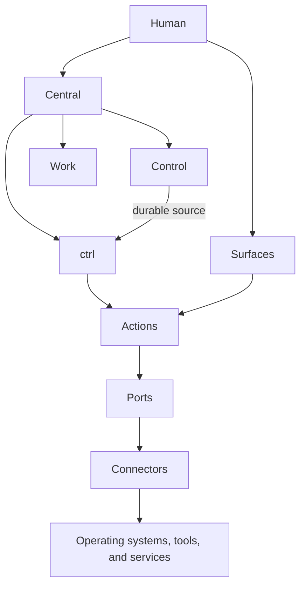
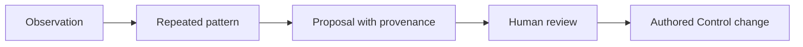
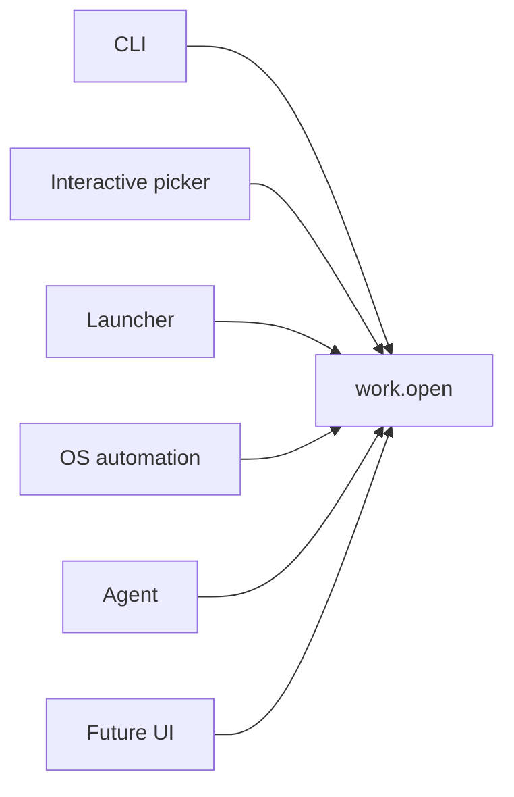
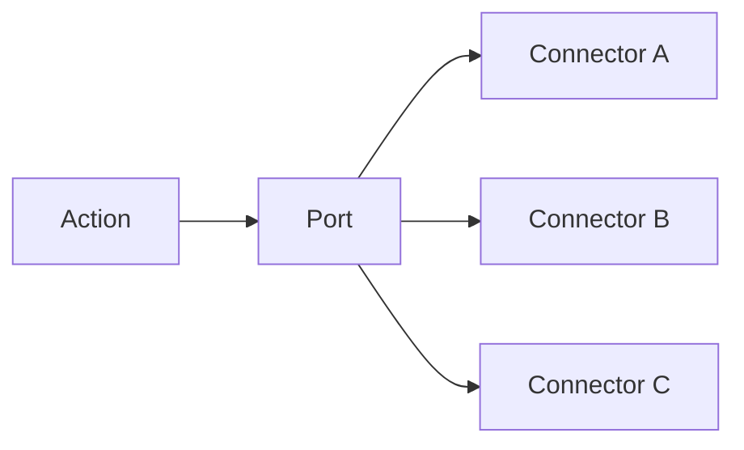

# Central — Product Vision

**Status:** product vision

## Purpose

Central is a human-owned operating root for an agentic computing life.

Central gives a person one durable place for authored control material, executable control actions, and ordinary work. The user can understand this place with normal filesystem tools. Optional software can index it, operate on it, or present it through another interface without becoming the owner of the source material.

Central has three direct purposes:

1. **Preserve durable intent.** Control stores information that the human deliberately chooses to retain.
2. **Provide one action language.** `ctrl` gives humans and software one stable set of actions over Central.
3. **Keep work ordinary.** Work remains normal filesystem work and does not require a special project format.

## The product in one view



The architecture separates source, operation, and implementation:

```text
Control      what should persist
Actions      what can be done
Ports        what ability an Action requires
Connectors   how that ability exists on this machine
Surfaces     where a human or software actor invokes an Action
Work         the ordinary local field that Actions can operate on
```

## Control

Control is selective human-owned source. It does not contain every fact that software can collect.

```text
Control/
├── user/
├── agents/
└── machines/
```

`user/` describes the person and their durable relation to their working world. It can contain self-description, durable interests, important context objects, tool-use preferences, and stable working preferences.

`agents/` describes the recurring relation that the human wants with software agents. It can contain communication preferences, collaboration style, expected initiative, evidence and verification expectations, coding habits, evaluation criteria, and recognized lessons from repeated interaction.

For engineering work, Control can preserve durable ideals about what should justify confidence in agent-produced work. It does not need to own the concrete project checks, CI pipelines, merge gates, or provider configuration that enact those ideals. Those mechanisms remain at the scope where they are actually defined and executed.

`machines/` describes intended computing environments. It can contain machine roles, desired tools, package declarations, configuration sources, services, bootstrap mechanisms, shell configuration, and automation.

The system keeps authored intent separate from observed state. A statement such as "this is my primary workstation" is authored meaning. An OS version or installed package list is observed state.

## Information quality

Persistent information has a cost. Control therefore keeps information that has durable value in the contexts where it applies.

Typical high-value material includes stable communication preferences, durable decision criteria, useful domain language, strong positive examples, stable workflow constraints, persistent tool-use intent, machine-role intent, and important context objects.

Reusable procedure does not belong in general personal context. A skill, script, command, or other capability holds reusable procedure. Control can state a preference for that procedure or capability.

The system keeps information at the narrowest scope where it remains correct. Project-specific facts stay with the project. Temporary task facts stay with the task. Cross-context durable preferences can enter Control.

## Authored, observed, and inferred information

Central preserves three information classes:

```text
Authored   the human deliberately states, adopts, or retains it
Observed   software measures or discovers it
Inferred   software derives it from evidence
```

Only authored material is canonical Control source by default.

An agent can propose a durable Control change from observed or inferred evidence. The human reviews the proposal before the change becomes authored source.



## One action, many surfaces

A repeated operation has one canonical Action identity.

The same `work.open` Action can appear in the CLI, an interactive terminal picker, a launcher, an OS shortcut, a keybinding, an agent tool, or a future UI.



A Surface presents or invokes an Action. It does not own the operation.

## Ports and Connectors

Core Actions do not depend on named products.

An Action depends on one or more Ports. A Port states the ability that the Action requires. A Connector implements a Port for a specific platform, tool, or service.



The user-visible Action stays stable when the implementation changes.

## The SDK

The Connector SDK is part of the product architecture.

The SDK must let a developer or software agent:

1. read a Port contract;
2. create a Connector manifest;
3. implement the required operations;
4. declare platform and dependency requirements;
5. run conformance tests;
6. test the Connector against fixtures or a real target;
7. inspect capability and failure results;
8. register the Connector without changing core Action logic.

The first real extension set must use the same SDK and public contracts that other extensions use. The project must not add private code paths for its own preferred environment.

## Skills and Control content

Control content and agent skills have different functions.

```text
Control content   states what matters, what persists, and what relation the human wants
Agent skill       defines how an agent performs a reusable procedure
```

Central can include maintenance skills that help an agent audit Control, propose a durable preference, review a proposed change, author a machine declaration, build a Connector, or diagnose a conformance failure. These skills operate on Control. They do not replace Control content.

## Availability and disclosure

A file can exist in Control without entering every agent context.

Central distinguishes these conditions:

```text
exists
can be indexed
can be retrieved
is relevant
is permitted for the current use
is loaded now
```

The first implementation can use simple filesystem retrieval. The architecture does not assume that all persistent material is always loaded.

## Work stays ordinary

`Work/` contains normal directories. Central does not require a manifest before a directory can exist. It does not require Git. It does not force all project identity into one local path.

The first work Actions can discover, list, find, open, reveal, and tag ordinary Work directories.

## Native platform functions and extensions

Native operating-system functions form the base integration where practical. Optional tools can improve discovery, interaction, automation, package operations, and configuration operations.

The relation stays constant:

```text
Action
  ↓
Port
  ↓
Connector
  ↓
platform, tool, or service
```

No Connector becomes the product architecture.

## Personal extension as architecture proof

The project's own installation is the first complete consumer of the extension system. It must use public Ports, the public SDK, and the same conformance tests that external extensions use.

The personal extension set must prove that:

- core Actions work without personal extensions;
- launcher integration reads the canonical Action description;
- native automation can invoke the same Actions;
- package and configuration functions use replaceable Connectors;
- another operating-system environment can implement equivalent Ports without changing core Action identity;
- failures found during real use improve public contracts instead of creating private shortcuts.

## Product experience

The CLI supports explicit and guided use.

Explicit use supports scripts and software actors:

```text
ctrl open research-canvas
ctrl machine inspect
ctrl machine apply
ctrl doctor
```

Guided use supports search and selection:

```text
ctrl
```

The product uses one interaction model across surfaces:

```text
find Action
→ supply or select inputs
→ preview when required
→ execute
→ receive a structured result
```

## Success condition

Central succeeds when a person can create or recover one human-owned root, understand it without special software, operate it through one clear CLI, reproduce intended parts of a machine, extend it for a new stack through a stable SDK, and let software agents use the same Action and content contracts without giving those agents ownership of the human source.

The product must remain coherent when any optional Connector disappears. It must become more useful as extensions increase without making the conceptual core expand at the same rate.
