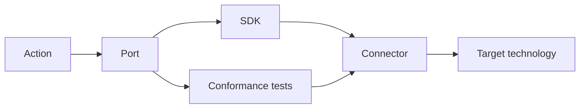
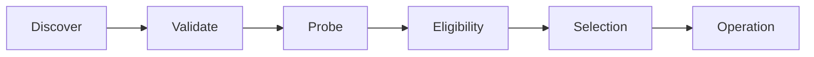

# Central — Connector SDK Specification

**Status:** normative SDK specification

## 0. Purpose

The Connector SDK is a required part of Central.

The SDK lets a new operating system, tool, service, launcher, automation system, package system, or configuration system implement a Central Port without changing core Action logic.

The project must use the same SDK for its own personal extensions.

This requirement tests the architecture. A preferred local technology does not get a private integration path.

## 1. Core relation



The responsibilities are:

```text
Action       defines the semantic operation
Port         defines the required capability
Connector    binds that capability to a real technology
SDK          makes the binding implementable and testable
```

## 2. SDK invariants

The SDK must preserve these rules:

1. A Connector can be developed without an edit to core Action logic.
2. A Connector can read its complete Port contract from public project material.
3. A Connector can run Port conformance tests before normal use.
4. Core code can test Connector eligibility before it selects the Connector.
5. A Connector returns typed output and typed failure data.
6. A Connector does not change the semantic meaning of a Port operation.
7. Removal of one optional Connector does not disable unrelated core Actions.
8. Personal Connectors use the same registration and conformance paths as other Connectors.
9. The SDK documentation must be usable by both a developer and an agent that follows the Connector-authoring Skill.

## 3. Port contract package

Each Port must publish a contract package.

The package must define:

- Port identifier;
- purpose;
- operations;
- input types;
- output types;
- capability-probe behavior;
- shared error types;
- mutation class;
- preview requirement when applicable;
- repeat or idempotence requirements when applicable;
- conformance tests.

A Port states what a caller can rely on.

A Port must not prescribe a specific provider when the capability is provider-neutral.

## 4. Connector package

A Connector is a self-contained extension package.

It must contain:

```text
manifest
implementation
connector-specific tests
```

It can also contain fixtures and user documentation.

The Connector must use only public SDK seams for the Ports that it implements.

## 5. Connector manifest

The manifest must be machine-readable.

It must declare:

```text
id
version
display name
implemented Ports
supported platforms or environments
entrypoint
runtime requirements
dependency probes
configuration requirements
mutation scope
```

It can also declare provider-specific Actions and known limitations.

A Connector must not claim Port support when it cannot pass the Port conformance suite.

## 6. Discovery and eligibility

The normal Connector path is:



### 6.1 Discover

`ctrl` must discover Connectors from configured extension locations or supported package metadata.

A new Connector must not require a source edit to a hard-coded core list.

### 6.2 Validate

`ctrl` must validate the manifest before it uses the Connector.

### 6.3 Probe

The Connector must provide a safe capability probe for the dependencies that determine eligibility.

### 6.4 Eligibility

A Connector is eligible only when:

- it declares the required Port;
- the current environment matches its support declaration;
- its required dependencies are available;
- its required configuration is valid;
- its capability probe succeeds.

## 7. Selection

More than one Connector can implement one Port.

The resolver must keep these concepts separate:

```text
availability
eligibility
preference
selection
```

A user preference cannot make an unavailable Connector eligible.

Selection must be deterministic and explainable.

Diagnostics must be able to show:

- eligible Connectors;
- ineligible Connectors and reasons;
- applicable preference;
- selected Connector.

## 8. Initial Port field

The first product architecture uses a small Port field. Exact method signatures belong to implementation and tests.

### 8.1 `WorkDiscovery`

Discovers and resolves ordinary Work items.

### 8.2 `NativeOpen`

Opens a target through the normal host user experience.

### 8.3 `NativeReveal`

Reveals a target through the normal host filesystem surface.

### 8.4 `TagStore`

Reads and changes optional local metadata tags.

### 8.5 `PackageManager`

Inspects and changes package state for machine Actions.

### 8.6 `ConfigurationManager`

Inspects and applies portable user or machine configuration through a suitable configuration mechanism.

### 8.7 `Automation`

Discovers and invokes named host or application automation.

### 8.8 `LauncherSurface`

Projects canonical Action discovery and invocation into a searchable launcher.

### 8.9 `MachineInspector`

Collects structured current-state observations required by machine planning and Connector eligibility.

## 9. Provider-specific Actions

A Connector can expose a namespaced Action for a capability that is specific to its target technology.

A provider-specific Action must not replace an existing core Action with the same semantic meaning.

If the same semantic capability appears across several Connectors, the project should evaluate a new general Port and core Action.

## 10. Typed results

A Connector must return structured Port output.

Core code must not parse human terminal text to determine the meaning of a Connector result.

When the target technology only provides text, the Connector owns the conversion to a structured result.

Shared errors must distinguish at least:

```text
unsupported environment
missing dependency
invalid configuration
capability unavailable
invalid input
provider operation failed
permission failure
verification failure
unexpected Connector failure
```

Provider-specific diagnostic detail can accompany a shared error type.

## 11. Mutation and preview

A Port operation must declare its mutation class.

When a useful preview exists, the Port contract must define the preview result.

A preview must not perform the requested mutation.

Machine change Connectors must fit the machine plan, apply, and verify cycle defined by the system specification.

## 12. Conformance

Conformance is part of the public Port contract.

A Connector must be testable for:

1. manifest validity;
2. safe capability probing;
3. typed operation behavior;
4. required failure behavior;
5. preview and mutation behavior when applicable;
6. repeat behavior when the Port defines it;
7. useful diagnostics.

The SDK must provide reusable fixtures or test doubles where practical.

Real target tests remain necessary for behavior that a fixture cannot prove.

## 13. Contract compatibility

A Port contract must have a compatibility identity.

A Connector must declare the compatible contract identity that it implements.

A breaking semantic change must be explicit.

A compatible extension should not make an existing conforming Connector invalid.

## 14. SDK developer surface

The SDK must provide a scriptable developer path for these tasks:

- create a Connector scaffold;
- validate a manifest;
- inspect the Port contract that must be implemented;
- run Connector tests;
- run Port conformance tests;
- run the capability probe;
- inspect registration and eligibility;
- explain conformance failures.

Exact command names can follow the implementation language and CLI design.

## 15. Standard authoring flow

A Connector author follows this sequence:

```text
select Port
→ read Port contract
→ inspect target technology
→ scaffold Connector
→ implement capability probe
→ implement Port operations
→ run conformance tests
→ add target-specific tests
→ test against the real target
→ register Connector
→ invoke a core Action through the Connector
```

The author must not add a provider-specific condition to a core Action only to make the Connector pass.

When real use exposes a general missing capability, the project must evaluate the Port contract itself.

## 16. Connector-authoring Skill

The repository must contain a Connector-authoring Skill.

The Skill must tell an agent to:

1. read the current Port contract first;
2. inspect the target system and its authoritative documentation;
3. preserve the Action, Port, Connector boundary;
4. use the SDK scaffold and public interfaces;
5. implement the capability probe;
6. implement typed Port operations;
7. run conformance tests throughout the work;
8. classify failures at the correct architecture layer;
9. avoid private core exceptions;
10. finish with a real target test when practical.

The Skill must treat the Port contract as authoritative. An existing Connector is an example, not the definition of the Port.

## 17. Connector hardening

The project must use real extension work to harden the SDK.

A failure must be classified as one of these types before the fix is selected:

```text
Action behavior
Port contract
SDK support
Connector implementation
Target limitation
Connector configuration
```

A general problem belongs in the public contract or SDK.

A target-specific problem belongs in the Connector.

The relevant conformance or regression test must change with the fix.

## 18. Personal extensions

The project's own extension set must act as an external SDK consumer.

Personal Connectors must use:

- public manifests;
- public Port interfaces;
- normal discovery;
- normal eligibility checks;
- normal selection;
- normal conformance tests.

Personal extension source must not depend on private core modules unless those modules are intentionally part of the public SDK.

This rule makes daily use an architecture test.

## 19. External SDK proof

The SDK is proven when a new Connector can be built from public project material.

A valid proof exercise is:

1. choose one published Port;
2. provide the SDK, Port contract, and target access to a fresh developer or agent session;
3. build the Connector without private implementation instructions;
4. pass conformance tests;
5. invoke one canonical core Action through the new Connector;
6. record whether any core change was necessary and why.

## 20. Distribution

Connector distribution is separate from Connector semantics.

The architecture must support local development Connectors first and leave room for user-installed or separately packaged Connectors.

Connector identity and manifest meaning must stay stable across distribution methods.

## 21. Acceptance criteria

The SDK satisfies this specification when:

1. Port contracts are public and machine-testable.
2. A new Connector registers without a hard-coded core source edit.
3. A new Connector can run the Port conformance suite.
4. Core Actions resolve eligible Connectors by Port.
5. Several Connectors can implement one Port.
6. Connector selection is deterministic and explainable.
7. Missing dependencies produce explicit ineligibility or typed errors.
8. Connector results do not require core parsing of provider terminal prose.
9. Personal extensions use only public SDK seams.
10. A second host environment implements shared Ports with different Connectors.
11. A fresh agent or developer can build a conforming Connector from the SDK and Skill.
12. Real extension failures can harden the correct public contract without adding personal-stack exceptions.

## 22. Summary

The SDK protects this dependency direction:

```text
Action
  ↓
Port
  ↓
Connector
  ↓
real technology
```

The project uses the same path for its own environment. There is no privileged integration route.
