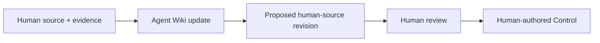

# Control — Content Protocol

**Status:** normative content specification

## 0. Purpose

Control is the durable local authorship-and-knowledge layer inside Central.

It keeps the human's authored world distinct from Agent-maintained knowledge while making their relation obvious and traversable. This document specifies what belongs in Control, how scope works, how durable source differs from current machine state, and how Agent Skills help maintain both human-facing source relations and the Agent Wiki without collapsing their authority.

The protocol defines three stable roots:

```text
Control/
├── user/
├── agents/
│   ├── governance/
│   └── wiki/
└── machines/
```

The protocol does not define a fixed schema below `user/`, `agents/governance/`, or `machines/`. `agents/wiki/` uses the portable Wiki grammar accepted by the knowledge layer rather than a Central-only schema.

The same human-source ↔ Agent-Wiki relation recurs inside ProjectCentral:

```text
ProjectCentral/
├── user/
└── agents/
    ├── governance/
    └── wiki/
```

This recursive shape is intentional. Skills can understand one filesystem law at personal and Project scope rather than learning unrelated layouts.

## 1. Persistence rule

A Control item must have durable value.

Use this test:

> Would the absence of this information materially reduce future understanding, interaction quality, decision quality, or reproducibility in the contexts where the information applies?

If the answer is no, keep the information at a narrower or temporary scope.

Control must stay smaller than the total information that tools can discover about a person or machine.

## 2. Source classes

### 2.1 Human-authored source

Human-authored source is information that the human deliberately states, adopts, or retains.

It is canonical as human source. Normal examples live under `Control/user/`, `Control/agents/governance/`, `Control/machines/`, ProjectCentral `user/`, or ordinary Project source.

### 2.2 Agent-authored / Agent-maintained knowledge

Agent-maintained knowledge is durable semantic knowledge about or across source material.

Its canonical Control location is `Control/agents/wiki/`; at Project scope it is `ProjectCentral/agents/wiki/`.

Agent knowledge does not acquire human-source authority merely because it is durable. Consequential Wiki knowledge should retain source/provenance and distinguish observation, inference, authorship and derived synthesis where the Wiki grammar supports them.

### 2.3 Observed state

Observed state is current information that software measures or discovers.

Examples include an OS release, an installed program, an available service, a current host identifier, test output, or repository state.

Observed state can support a Wiki update or a proposed human-source change. It does not become human-authored source automatically.

### 2.4 Generated / derived material

Generated material is a projection, summary, index, cache, or target-specific representation made from source material.

Generated material must keep a link to its source where practical. Rebuildable operational state such as `.central/derived/**` must not silently become either human source or durable Wiki authority.

A durable Agent Wiki is not classified as disposable generated state merely because Agents maintain it. Its authority comes from its explicit Agent-knowledge role and provenance, not from `.central` indexing.

## 3. Scope rule

Keep information at the narrowest scope where it stays correct.

```text
Control-global
    durable across unrelated work where applicable

Domain or activity
    durable for a recurring class of work

Project-local
    durable for one project

Session or task
    useful for current work

Ephemeral
    useful for a short action only
```

A project fact normally stays with its project or Project Wiki. A temporary plan stays with the task. A durable cross-context preference can enter Control governance or human source.

Information does not move to global Control only because it was useful once.

## 4. `Control/user/`

### 4.1 Function

`Control/user/` is the human's durable personal authorship space.

It is human-authored. It may be Agent-readable subject to retrieval treatment, but Agent readability does not change authorship.

### 4.2 Useful content

Useful content can include:

- autobiographical or self-descriptive prose;
- durable interests and concerns;
- important context objects;
- stable cross-project working preferences that describe the human rather than Agent governance;
- durable tool-use descriptions;
- durable decision criteria;
- concepts and terms that prevent repeated misunderstanding;
- documents, data, media, notes or other ordinary files that the human wants to retain as durable source.

### 4.3 Representation

Natural prose is a first-class format.

The user must not need to convert self-description into a universal profile schema.

Use structured data when the object has real structure that software must preserve or validate.

A structured format must earn its maintenance cost.

The directory is an authorship space, not a prescribed document template. The human may structure it however they wish.

### 4.4 Example

```text
I use a launcher as my main interactive command surface.

For interface work, I prefer direct visual review of a working candidate over a prose description of the proposed result.
```

These statements describe durable relations. They do not state whether a given program is installed now.

## 5. `Control/agents/`

### 5.1 Function

`Control/agents/` is the durable Agent-facing side of the Control relation. It contains two different authorities which must remain explicit:

```text
Control/agents/
├── governance/   human-authored recurring Agent relationship/governance
└── wiki/         Agent-authored / Agent-maintained semantic knowledge
```

The parent directory is therefore not itself one undifferentiated source class.

### 5.2 `Control/agents/governance/`

`Control/agents/governance/` describes the recurring relation that the human wants with software agents.

It is human-governed source.

Useful content can include:

- communication preferences;
- collaboration style;
- initiative preferences;
- evidence and verification expectations;
- cross-project coding habits;
- durable evaluation criteria;
- useful positive examples;
- preferred capability or method classes;
- stable rules for when a human decision is important.

Durable verification preferences can belong here when they describe the human's general expectations for Agent-produced engineering work.

Control holds the durable ideal or preference. Exact test commands, CI-provider configuration, repository gates, workflow triggers, coverage thresholds, project test seams, release checks, and other concrete verification mechanisms normally remain with the Project or capability that operates them.

For example:

```text
Control/agents/governance:
For engineering work, completion claims should be backed by appropriate executed evidence. Normal implementation changes should preserve the project's existing assurance rather than weaken it merely to obtain a pass.

Project-local source:
The exact tests, checks, review procedures, CI workflows, and merge requirements that establish sufficient evidence for this project.
```

State desired behavior directly when possible. Use good examples when they communicate the requirement more clearly than long rules.

### 5.3 `Control/agents/wiki/`

`Control/agents/wiki/` is the durable Agent-maintained personal/root Wiki.

It compiles knowledge from eligible human source, Project descriptors, child Project WikiSpaces, observations and other sources while preserving provenance. Its canonical root source is:

```text
Control/agents/wiki/wiki.json
```

The Wiki does not replace `Control/user/`, governance, Project source, or evidence. It is a navigable knowledge layer **about/across** them.

The normal cognitive relation is:

```text
human source
    ↓
Agent Wiki
    ↓
bounded traversal
    ↓
exact source/evidence when required
```

### 5.4 Existing pre-split `Control/agents/*`

Material created before the `governance/` + `wiki/` split must retain its known authorship. Existing human-authored files directly under `Control/agents/` remain human-governed source until explicitly reorganised. Central must not infer that an old file became Agent-authored knowledge because the directory contract evolved.

### 5.5 Skill boundary

`Control/agents/governance/` is not the Skill registry and `Control/agents/wiki/` is not a giant system prompt.

```text
Agent governance
    durable human-authored relationship/preference source

Agent Wiki
    durable semantic knowledge and provenance

Skill
    reusable Agent procedure
```

A governance source can name a preferred Skill or capability. The procedure stays in the Skill. A Wiki-maintenance Skill can operate the Wiki without embedding the entire Wiki in session context.

## 6. `Control/machines/`

### 6.1 Function

`Control/machines/` describes intended computing environments and portable machine roles.

It is human-authored and machine-facing.

### 6.2 Useful content

Useful content can include:

- machine roles;
- intended tool classes;
- desired packages;
- package declaration sources;
- configuration declaration sources;
- shell configuration;
- service requirements;
- automation sources;
- bootstrap mechanisms;
- synchronization mechanisms;
- references to external secret mechanisms.

### 6.3 Intent and observation

Keep intended state separate from observed state.

```text
Authored intent:
The primary workstation must provide a fast interactive command surface.

Observed state:
A specific launcher is currently installed at a specific version.
```

The first can belong in Control human source. The second normally belongs in local observation/derived state unless it is intentionally represented in the Wiki with observation provenance.

### 6.4 Machine roles

Prefer durable roles to fragile host identifiers where possible.

Examples:

```text
primary-workstation
home-server
portable-laptop
```

A current host name or network address can be an observed binding to the role.

## 7. High-value durable information

Control should favor material that does at least one of these things:

1. prevents repeated misunderstanding;
2. provides a durable decision criterion;
3. changes the expected interaction in a useful way;
4. reduces repeated tool-choice guesswork;
5. supports machine reproducibility;
6. provides compact shared language for repeated work;
7. preserves useful semantic knowledge that would otherwise have to be re-derived.

## 8. Content that normally belongs elsewhere

Do not put these things in durable global human Control by default:

- active task plans;
- completed plans that no longer describe the current system;
- temporary requirements;
- project-specific architecture that belongs in the Project;
- project-specific CI workflows, test commands, gates, and verification procedures;
- long reusable procedures that should be Skills;
- raw current package inventories without authored intent;
- raw conversation history;
- repeated instructions that do not change behavior;
- stale material that now conflicts with current source;
- secret values in normal prose.

Project-specific semantic knowledge belongs in the ProjectCentral Agent Wiki rather than being promoted globally only because it was learned by an Agent.

## 9. The deletion test

A Control audit should ask:

> If this item is removed, what useful behavior or understanding changes?

If the answer is unclear, the item is a candidate for removal, relocation, consolidation, or Wiki re-derivation.

This is a value test, not a length test. A long human document or a richly connected Wiki node set can have durable value.

## 10. Durable change and source-return proposals

An Agent or tool can propose a change to human-authored Control source.

A human-source proposal must include:

- the target source;
- the proposed content;
- the reason for the change;
- relevant supporting context;
- the final diff before mutation.

The human accepts, changes, or rejects the proposal. Human source changes only through an explicit accepted mutation.

An Agent Wiki update is a different operation. It may be maintained by an authorised Wiki-maintenance procedure when its provenance and epistemic status are preserved. Updating Agent knowledge does not confer permission to rewrite human source.



## 11. Progressive disclosure

Control is a source domain and Wiki world. It is not one global prompt.

The system must distinguish:

```text
source exists
source is known to exist
source can be retrieved
source is relevant
source is allowed for the current use
source is loaded now
```

A retrieval system can expose a small source/Wiki map and load detail only when the task requires it.

## 12. Source treatment

The protocol must leave room for different treatment classes, including:

```text
portable normal source
local-only source
encrypted source
not agent-readable
agent-readable in an eligible context
```

The ordinary `.no-agent-retrieval` marker establishes a denied subtree for stock Agent-facing traversal. The marker applies by role, not by a magic directory name: a human can create `user/private/` or any other structure and place the marker there.

The protocol does not require one repository remote to contain every Control object.

Secrets should use a dedicated secret mechanism or external secret reference.

## 13. Conflict and supersession

A maintenance tool must not silently combine contradictory human-authored statements.

It should show conflicting sources and scopes. The human resolves an authored conflict.

Agent Wiki knowledge may record that a conflict exists, including source refs and current evidence, without pretending to resolve human authority.

When a human statement becomes obsolete, the live source tree should make the current statement clear. Git/source history can preserve older states.

## 14. Control-maintenance Skills

Skills provide procedure around Control. They do not become Control content.

### 14.1 Control audit Skill

The Skill should:

1. inspect the relevant Control root;
2. identify stale, duplicate, conflicting, or misplaced human source;
3. distinguish human-authored source, Agent Wiki knowledge, observations and rebuildable generated material;
4. identify procedure that should become a Skill or Action;
5. identify important durable preference areas that are absent or unclear when the current dialogue makes them relevant;
6. propose human-source changes with reasons;
7. request acceptance before durable human-source mutation.

### 14.2 Wiki maintenance Skill

The Wiki-maintenance Skill should:

1. inspect eligible human source and source revisions;
2. inspect current Wiki nodes/edges and their provenance;
3. add or revise Agent knowledge without silently rewriting human source;
4. mark stale, conflicting, observed and inferred material distinctly;
5. preserve exact source refs for return;
6. propose a human-source revision when returned reality warrants one.

The same procedure should work against `Control/user → Control/agents/wiki` and `ProjectCentral/user → ProjectCentral/agents/wiki` because the filesystem relation is recursive.

### 14.3 Durable-preference proposal Skill

The Skill should:

1. gather supporting examples for a repeated cross-context preference;
2. identify the correct scope;
3. draft a direct positive statement or example;
4. show the supporting material;
5. request human acceptance.

### 14.4 Machine declaration Skill

The Skill should:

1. inspect the target machine or stack;
2. separate current observation from intended state;
3. propose a portable machine role and declaration;
4. identify required Ports;
5. identify available and missing Connectors;
6. leave target-specific implementation in Connectors or referenced configuration sources.

## 15. Retrieval-oriented authoring

Humans can write naturally and structure their authored space naturally.

Use these practices when they improve discovery:

- clear document titles;
- descriptive headings;
- explicit scope where scope can be misunderstood;
- stable technical terms;
- links between related local sources;
- small structured metadata only when it materially improves retrieval or treatment.

The protocol must not require every file to become a database-shaped document or every Project to have a prescribed README.

## 16. Quality criteria

A healthy Control tree has these properties:

1. The human can read and organise their source directly.
2. Important durable material is easy to find.
3. Global material is genuinely cross-context.
4. Project and temporary content has not leaked upward without reason.
5. Reusable procedure is mainly outside persistent context.
6. Human source, Agent Wiki knowledge, observations and rebuildable derived state are distinguishable.
7. Proposed human-source changes are reviewed before source mutation.
8. Agent Wiki knowledge can be maintained without becoming a giant prompt.
9. Sensitive material has an explicit safe treatment.
10. The tree can grow without a universal personal schema.
11. The same human-source ↔ Agent-Wiki relation is recognisable in ProjectCentral.

## 17. Summary

Control is not a memory dump and the Wiki is not a replacement for authored source.

The durable relation is:

```text
human-authored world
        ↓
selective Agent-readable source
        ↓
Agent-maintained Wiki knowledge
        ↓
bounded return to exact source/evidence
        ↓
Wiki revision or explicit proposal back to human source
```

At Project scope, ProjectCentral repeats the same relation. Skills operate that relation; they do not replace either side of it.
