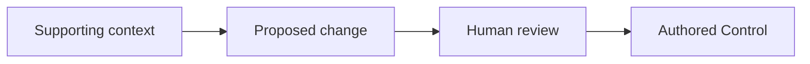

# Control — Content Protocol

**Status:** normative content specification

## 0. Purpose

Control is the durable human-owned source layer inside Central.

This document specifies what belongs in Control, how scope works, how durable source differs from current machine state, and how agent Skills help maintain the source.

The protocol defines three stable roots:

```text
Control/
├── user/
├── agents/
└── machines/
```

The protocol does not define a fixed schema below these roots.

## 1. Persistence rule

A Control item must have durable value.

Use this test:

> Would the absence of this information materially reduce future understanding, interaction quality, decision quality, or reproducibility in the contexts where the information applies?

If the answer is no, keep the information at a narrower or temporary scope.

Control must stay smaller than the total information that tools can discover about a person or machine.

## 2. Source classes

### 2.1 Authored source

Authored source is information that the human deliberately states, adopts, or retains.

Authored source is the normal canonical material in Control.

### 2.2 Observed state

Observed state is current information that software measures or discovers.

Examples include an OS release, an installed program, an available service, or a current host identifier.

Observed state can support a proposed Control change. It does not become authored source automatically.

### 2.3 Generated material

Generated material is a projection, summary, index, or target-specific representation made from source material.

Generated material must keep a link to its source where practical. It must not silently replace the source.

## 3. Scope rule

Keep information at the narrowest scope where it stays correct.

```text
Control-global
    durable across unrelated work where applicable

Domain or activity
    durable for a recurring class of work

Project-local
    durable for one project

Session or task
    useful for current work

Ephemeral
    useful for a short action only
```

A project fact normally stays with its project. A temporary plan stays with the task. A durable cross-context preference can enter Control.

Information does not move to Control only because it was useful once.

## 4. `Control/user/`

### 4.1 Function

`Control/user/` describes the human and their durable relation to their working world.

It is human-authored and primarily agent-facing.

### 4.2 Useful content

Useful content can include:

- autobiographical or self-descriptive prose;
- durable interests and concerns;
- important context objects;
- stable cross-project working preferences;
- durable tool-use descriptions;
- durable decision criteria;
- concepts and terms that prevent repeated misunderstanding.

### 4.3 Representation

Natural prose is a first-class format.

The user must not need to convert self-description into a universal profile schema.

Use structured data when the object has real structure that software must preserve or validate.

A structured format must earn its maintenance cost.

### 4.4 Example

```text
I use a launcher as my main interactive command surface.

For interface work, I prefer direct visual review of a working candidate over a prose description of the proposed result.
```

These statements describe durable relations. They do not state whether a given program is installed now.

## 5. `Control/agents/`

### 5.1 Function

`Control/agents/` describes the recurring relation that the human wants with software agents.

It is human-governed source.

### 5.2 Useful content

Useful content can include:

- communication preferences;
- collaboration style;
- initiative preferences;
- evidence and verification expectations;
- cross-project coding habits;
- durable evaluation criteria;
- useful positive examples;
- preferred capability or method classes;
- stable rules for when a human decision is important.

### 5.3 Positive form

State the desired behavior directly when possible.

Use a good example when an example communicates the requirement more clearly than a long rule.

Use stable leading terms when those terms already carry precise shared meaning.

### 5.4 Skill boundary

`Control/agents/` is not the Skill registry.

```text
Control/agents
    durable relationship and preference source

Skill
    reusable agent procedure
```

Control can name a preferred Skill or capability. The procedure stays in the Skill.

## 6. `Control/machines/`

### 6.1 Function

`Control/machines/` describes intended computing environments and portable machine roles.

It is human-authored and machine-facing.

### 6.2 Useful content

Useful content can include:

- machine roles;
- intended tool classes;
- desired packages;
- package declaration sources;
- configuration declaration sources;
- shell configuration;
- service requirements;
- automation sources;
- bootstrap mechanisms;
- synchronization mechanisms;
- references to external secret mechanisms.

### 6.3 Intent and observation

Keep intended state separate from observed state.

```text
Authored intent:
The primary workstation must provide a fast interactive command surface.

Observed state:
A specific launcher is currently installed at a specific version.
```

The first can belong in Control. The second normally belongs in local derived state.

### 6.4 Machine roles

Prefer durable roles to fragile host identifiers where possible.

Examples:

```text
primary-workstation
home-server
portable-laptop
```

A current host name or network address can be an observed binding to the role.

## 7. High-value durable information

Control should favor material that does at least one of these things:

1. prevents repeated misunderstanding;
2. provides a durable decision criterion;
3. changes the expected interaction in a useful way;
4. reduces repeated tool-choice guesswork;
5. supports machine reproducibility;
6. provides compact shared language for repeated work.

## 8. Content that normally belongs elsewhere

Do not put these things in durable global Control by default:

- active task plans;
- completed plans that no longer describe the current system;
- temporary requirements;
- project-specific architecture;
- long reusable procedures;
- raw current package inventories without authored intent;
- raw conversation history;
- repeated instructions that do not change behavior;
- stale material that now conflicts with current source;
- secret values in normal prose.

## 9. The deletion test

A Control audit should ask:

> If this item is removed, what useful behavior or understanding changes?

If the answer is unclear, the item is a candidate for removal, relocation, or consolidation.

This is a value test, not a length test. A long document can have durable value.

## 10. Durable change proposals

A tool or agent can propose a Control change.

A proposal must include:

- the target source;
- the proposed content;
- the reason for the change;
- relevant supporting context;
- the final diff before mutation.

The human accepts, changes, or rejects the proposal.

The durable source changes only through an explicit accepted mutation.



## 11. Progressive disclosure

Control is a source domain. It is not one global prompt.

The system must distinguish:

```text
source exists
source can be indexed
source can be retrieved
source is relevant
source is allowed for the current use
source is loaded now
```

A retrieval system can expose a small source map and load detail only when the task requires it.

## 12. Source treatment

The protocol must leave room for different treatment classes, including:

```text
portable normal source
local-only source
encrypted source
not agent-readable
agent-readable in an eligible context
```

The protocol does not require one repository remote to contain every Control object.

Secrets should use a dedicated secret mechanism or external secret reference.

## 13. Conflict and supersession

A maintenance tool must not silently combine contradictory authored statements.

It should show the conflicting sources and their scopes. The human resolves the authored conflict.

When a statement becomes obsolete, the live Control tree should make the current statement clear. Git history can preserve older source states.

## 14. Control-maintenance Skills

Skills provide procedure around Control. They do not become Control content.

### 14.1 Control audit Skill

The Skill should:

1. inspect the relevant Control root;
2. identify stale, duplicate, conflicting, or misplaced content;
3. distinguish authored content from generated material;
4. identify procedure that should become a Skill or Action;
5. propose changes with reasons;
6. request acceptance before durable mutation.

### 14.2 Durable-preference proposal Skill

The Skill should:

1. gather supporting examples for a repeated cross-context preference;
2. identify the correct scope;
3. draft a direct positive statement or example;
4. show the supporting material;
5. request human acceptance.

### 14.3 Machine declaration Skill

The Skill should:

1. inspect the target machine or stack;
2. separate current observation from intended state;
3. propose a portable machine role and declaration;
4. identify required Ports;
5. identify available and missing Connectors;
6. leave target-specific implementation in Connectors or referenced configuration sources.

## 15. Retrieval-oriented authoring

Control authors can write naturally.

Use these practices when they improve discovery:

- clear document titles;
- descriptive headings;
- explicit scope where scope can be misunderstood;
- stable technical terms;
- links between related local sources;
- small structured metadata only when it materially improves retrieval or treatment.

The protocol must not require every prose file to become a database-shaped document.

## 16. Quality criteria

A healthy Control tree has these properties:

1. The human can read it directly.
2. Important durable material is easy to find.
3. Global material is genuinely cross-context.
4. Project and temporary content has not leaked upward without reason.
5. Reusable procedure is mainly outside persistent context.
6. Authored source is distinct from current observations and generated material.
7. Proposed durable changes are reviewed before source mutation.
8. Stale active material can be removed while repository history remains available.
9. Sensitive material has an explicit safe treatment.
10. The tree can grow without a universal personal schema.

## 17. Summary

Control is not a memory dump.

Control is the durable authored layer that tells future software and future machines what the human has chosen to preserve.

```text
experience or intent
        ↓
human authorship or accepted proposal
        ↓
correct scope
        ↓
durable Control source
        ↓
selective retrieval or machine use
```

Skills help maintain this source. They do not replace it.
