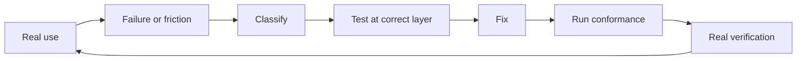

# Central — Personal Extension Specification

**Status:** normative proving-environment specification

## 0. Purpose

The personal extension set proves that the public Central architecture works against a real computing environment.

It is not a privileged implementation layer.

The extension set must use the same Action descriptors, Port contracts, Connector SDK, discovery rules, selection rules, and conformance tests that any other extension uses.

The proving environment has two machine roles:

```text
primary-workstation
    macOS personal workstation

home-server
    Ubuntu server
```

The product must be able to replace the specific tools in these environments without changing the relevant core Action identity.

## 1. Repository separation

The repository keeps authored Control source, product code, agent Skills, and extension source separate.

```text
Central/
├── Control/
│   ├── user/
│   ├── agents/
│   └── machines/
├── ctrl/
│   ├── core/
│   ├── sdk/
│   └── tests/
├── connectors/
│   ├── reference/
│   └── personal/
├── skills/
│   ├── control-maintenance/
│   ├── machine-declaration/
│   ├── connector-authoring/
│   └── connector-hardening/
├── docs/
├── .central/
└── Work/
```

`Control/` contains durable human-owned source.

`skills/` contains reusable agent procedure.

`connectors/` contains implementations of public Port contracts.

`ctrl/` contains the core Action system and the public SDK.

This separation is a product invariant.

## 2. Proving method

The personal extension work must use this sequence for each integration:

```text
real user need
    ↓
canonical Action
    ↓
required Port
    ↓
public SDK
    ↓
personal Connector
    ↓
Port conformance
    ↓
real-system acceptance
    ↓
daily use
    ↓
contract hardening when evidence requires it
```

The implementation must not start from the preferred product API and work upward into the core.

It must start from the semantic Action and Port boundary.

## 3. Primary workstation intent

The `primary-workstation` role represents the personal interactive machine.

Its authored intent should support these capabilities:

- fast project discovery and opening;
- a searchable action surface;
- global shortcuts for selected Actions;
- native file open and reveal behavior;
- native OS automation;
- optional filesystem metadata over Work;
- declarative package intent;
- portable configuration intent;
- shell access to all canonical Actions;
- structured Action access for software agents.

The machine declaration states the intent. It does not make the current installed state canonical.

## 4. macOS native base

The macOS extension set must first use native platform capabilities where practical.

The native layer should exercise these Ports or equivalent public contracts:

```text
NativeOpen
NativeReveal
TagStore
Automation
MachineInspector
```

### 4.1 Open and reveal

`work.open` and `work.reveal` must use provider-neutral Ports.

The macOS Connector can bind these Ports to native macOS behavior.

### 4.2 Finder metadata

A macOS metadata Connector can implement `TagStore` with Finder tags.

Finder tags remain optional local metadata. They do not define Work identity.

A different platform can omit this Connector or provide another `TagStore` implementation.

### 4.3 Shortcuts

A macOS automation Connector can bind the `Automation` Port to Shortcuts.

The integration must support both useful directions:

```text
ctrl Action
    → native automation

native automation
    → ctrl Action
```

The direction depends on which side owns the semantic operation.

## 5. Searchable launcher Surface

The personal workstation uses Raycast as the preferred searchable Surface.

Raycast is not a core dependency.

The Raycast Surface must consume canonical Action descriptors or a stable structured `ctrl` interface.

It must not contain a second implementation of core Actions.

The Surface should support:

- Action search;
- Work-item search;
- selectable Action inputs;
- Action-Bar operations where the Surface supports them;
- global hotkeys for selected Actions;
- human-readable success and failure state.

A complete removal of the Raycast Surface must leave the CLI Action behavior intact.

## 6. Package Connector

The personal macOS environment can use Homebrew as the first `PackageManager` Connector.

The core machine domain must not contain Homebrew-specific package semantics.

The Connector must translate between the public package Port and Homebrew behavior.

The authored machine source can reference a Brewfile or other package declaration when that file is the appropriate source for package intent.

The package declaration remains separate from a current package inventory.

## 7. Configuration Connector

The personal environment can use chezmoi as the first `ConfigurationManager` Connector where it provides a useful configuration materialization function.

The core machine domain must not require chezmoi.

The Connector binds the public configuration Port to chezmoi behavior.

Control can contain or reference the portable configuration source.

A different configuration Connector can replace it without changing `machine.plan`, `machine.apply`, or `machine.verify` as semantic Actions.

## 8. Ubuntu server proof

The `home-server` role provides the second materially different environment.

The Ubuntu proof must exercise shared core abstractions through different Connectors.

At minimum, it should prove:

- machine inspection on Linux;
- package operations through a Linux package Connector;
- configuration operations through a Linux-suitable Connector or direct public implementation;
- Central root discovery outside the macOS-specific integration set;
- structured `ctrl` operation without a graphical launcher dependency.

The server proof exists to find hidden workstation or macOS assumptions in the core.

## 9. Machine declaration Skill

The machine-declaration Skill is part of the proving process.

For each real machine, the Skill must help an agent:

1. inspect the current environment;
2. report observed tools and services separately from intended state;
3. read existing `Control/machines/` source;
4. propose a machine role or update when required;
5. identify the Ports that the intended environment requires;
6. inspect which Connectors already satisfy those Ports;
7. identify missing Connectors;
8. hand missing Connector work to the Connector-authoring Skill.

The Skill must not copy a complete observed package inventory into authored Control source without an explicit reason and human acceptance.

## 10. Connector-authoring proof

At least one personal Connector must be created in a fresh agent session by using only:

- the repository;
- the public SDK;
- the target Port contract;
- the Connector-authoring Skill;
- target-system documentation or direct target inspection.

The session must not receive private implementation instructions.

The Connector must pass conformance and invoke a canonical core Action.

This is a required acceptance test for agent-buildable extensibility.

## 11. Hardening loop

Daily use must feed failures back into the correct architecture layer.



The classification must distinguish:

```text
core Action behavior
Port contract
SDK support
Connector implementation
Surface implementation
target-system limitation
local configuration
```

The fix must occur at the narrowest correct layer.

A personal-only workaround must not replace a required general contract fix.

## 12. Surface proof

The personal setup must prove at least three invocation Surfaces over shared Actions:

1. explicit CLI;
2. guided or searchable human Surface;
3. software-agent structured invocation.

Native automation provides an additional integration path where useful.

The same Action must return semantically equivalent structured results regardless of Surface.

Surface-specific rendering can differ.

## 13. Personal Control content

The personal proving environment will create real content below:

```text
Control/user/
Control/agents/
Control/machines/
```

This content tests the content protocol.

The project must not add mandatory schema only because one person's current content has a convenient structure.

When real content repeatedly needs the same machine-readable relation, the project can propose an open structured format and test whether the relation is general.

## 14. Personal skills

The project uses its own maintenance Skills in normal operation.

The Skills must be able to:

- audit real Control content;
- propose durable Control changes without silent mutation;
- read a real machine and propose intended-state source;
- create a missing Connector through the SDK;
- harden a Connector after a real failure.

This use tests whether the Skills are executable procedures rather than descriptive documentation.

## 15. Acceptance matrix

| Requirement | Primary workstation | Home server | Core dependency? |
|---|---:|---:|---:|
| `ctrl` CLI | Required | Required | Yes |
| Central root | Required | Required | Yes |
| Control source | Required | Required as applicable | Yes |
| Work discovery | Required | Supported | Yes |
| Native open/reveal | macOS Connector | Linux Connector where useful | Port only |
| Searchable launcher | Raycast Surface | Not required | No |
| Native automation | Shortcuts Connector | Alternative optional | No |
| Metadata tags | Finder Connector | Alternative optional | No |
| Package operations | Homebrew Connector | Linux package Connector | Port only |
| Configuration operations | chezmoi or other Connector | Linux-suitable Connector | Port only |
| Machine inspection | macOS Connector | Linux Connector | Port only |
| Agent Connector build | Required proof | Required or repeated proof | SDK requirement |

## 16. Proof conditions

The personal extension system proves the architecture when all of these conditions hold:

1. The CLI remains usable when Raycast is absent.
2. Work Actions remain valid when Finder tags are absent.
3. Machine Actions remain valid when Homebrew is replaced by another package Connector.
4. Machine Actions remain valid when chezmoi is replaced by another configuration Connector.
5. The macOS and Ubuntu environments use shared Action identity where the semantic operation is the same.
6. All personal Connectors use public SDK contracts.
7. All personal Connectors run public conformance tests.
8. A fresh agent session can build at least one working Connector from public material.
9. Real daily use can produce a regression test and a fix at the correct architectural layer.
10. Personal Control content can grow without forcing its accidental structure into the universal protocol.

## 17. Summary

The personal extension set is not an example that sits beside the architecture.

It is the first external-grade consumer of the architecture.

It must prove this relation against real machines and real daily use:

```text
human intent
    ↓
Control
    ↓
canonical Action
    ↓
public Port
    ↓
public SDK Connector
    ↓
real machine or tool
```

The project improves the public architecture when this path exposes a general gap.
