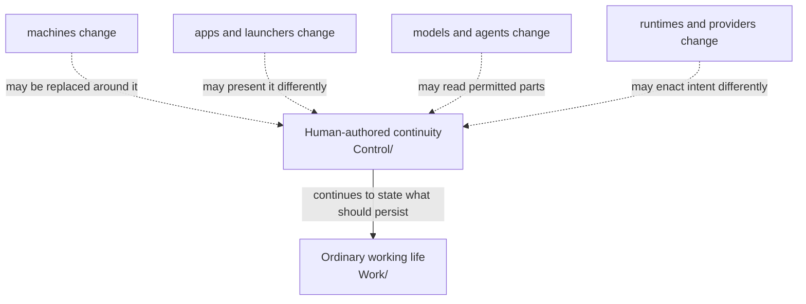
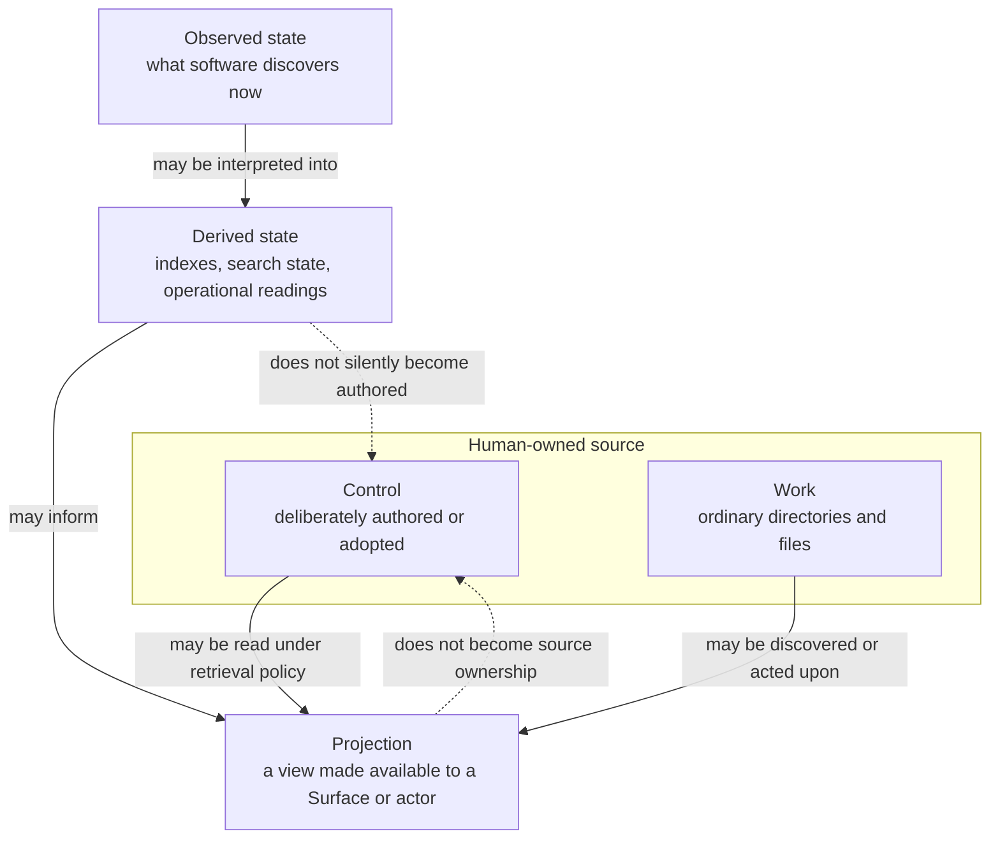
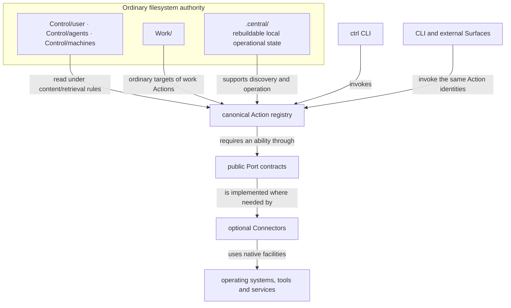

# Central Visual Product Understanding

**Status:** canonical product-understanding surface  
**Architecture status:** accepted `main`; open Personal/notification PRs are not treated as current implementation  
**Sources:** `CENTRAL-VISION.md`, `CENTRAL-SYSTEM-SPEC.md`, `CONTROL-CONTENT-PROTOCOL.md`, public CLI/Port/Connector contracts, and current Rust implementation.

Central is easiest to misunderstand when its extension plumbing appears before its human reason. The three diagrams below therefore begin with continuity, then distinguish kinds of material, then show the current software seams.

## 1. Experience — a durable authored root while the operative world changes

The human change is simple: durable intent and working continuity no longer have to live inside whichever application, model, launcher, or machine happens to be current. Central remains intelligible as ordinary files even when optional software disappears.

## 2. Product / conceptual relation — source, work, observation, projection

This is why Central is not a profile database. `Control` is authored source; `Work` stays ordinary; observed and derived material can support operation and presentation without acquiring canonical authorship merely because software computed it.

## 3. Architecture — current live seams

The implementation boundary is deliberate: Actions carry stable operation meaning; Ports state required abilities; Connectors supply platform-specific implementations. The filesystem remains source of truth for authored Control and ordinary Work. Current `main` does **not** include the still-open Personal proposal/notification tranche, so those semantics are not shown as current architecture.

## 4. Diagram audit

| Existing visual | Class | Disposition |
|---|---|---|
| `CENTRAL-VISION.md` Human → Central → Control/ctrl/Work → Ports/Connectors | architectural overview | **Demote as first-contact explanation.** Accurate plumbing, but it makes the reader meet infrastructure before continuity. Preserve as a lower architectural view. |
| `CENTRAL-VISION.md` Observation → pattern → proposal → human review → authored change | conceptual / target relation | **Preserve with status care.** It explains authorship discipline; proposal implementation beyond accepted `main` must not be inferred from the diagram alone. |
| `CENTRAL-VISION.md` one Action → many Surfaces | specialist conceptual | **Preserve.** It explains Action identity without defining Central as a UI framework. |
| `CENTRAL-VISION.md` Action → Port → Connectors | architectural | **Preserve.** It remains the right extension seam and appears as the lower half of the current architecture diagram. |
| system/recovery diagrams and directory trees | specialist architecture/operations | **Preserve.** They answer recovery, provider, and content-protocol questions after product orientation. |

## 5. Verification

**Semantic:** a reader can explain Central as durable human-owned continuity before learning `Port` or `Connector`. The distinction between authored source, ordinary Work, derived observation, and projection is spatially explicit.

**Implementation:** the architecture names only accepted filesystem, `ctrl`, Action, Port, Connector, and derived-state seams. Open Personal/notification work is excluded from current claims.

**Cross-product:** Central does not resolve an actor's runtime world like AIKit, govern agency like Actuation, or manage developmental Runs like Factory. It supplies a durable authored root and ordinary working field those products may reference without owning.

## 6. Public-site projection

Project the **continuity diagram** directly into the public/design surface: the visual idea should be a stable authored centre with replaceable surroundings. Reinterpret the source/work/derived/projection diagram for a deeper explanatory section. Keep the Action/Port/Connector architecture in technical documentation or an expandable “how it works” layer.